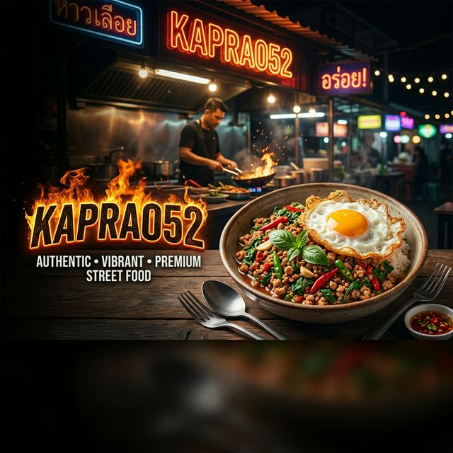
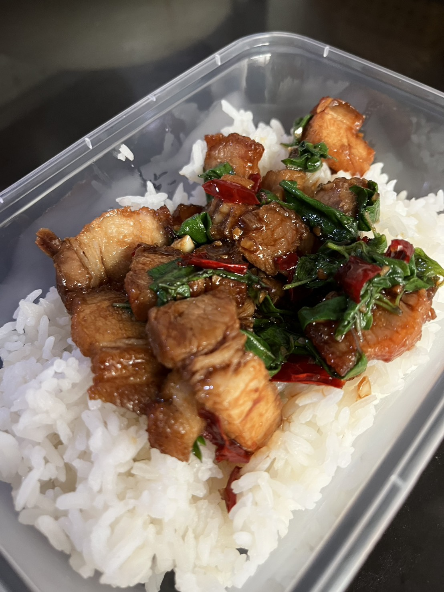
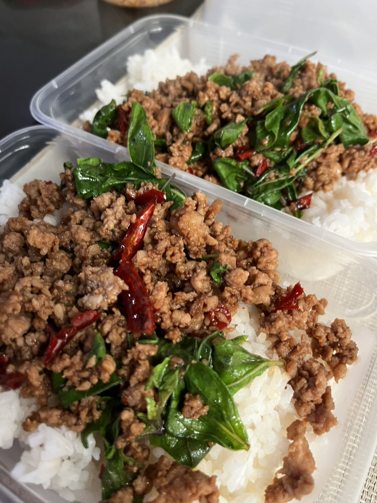
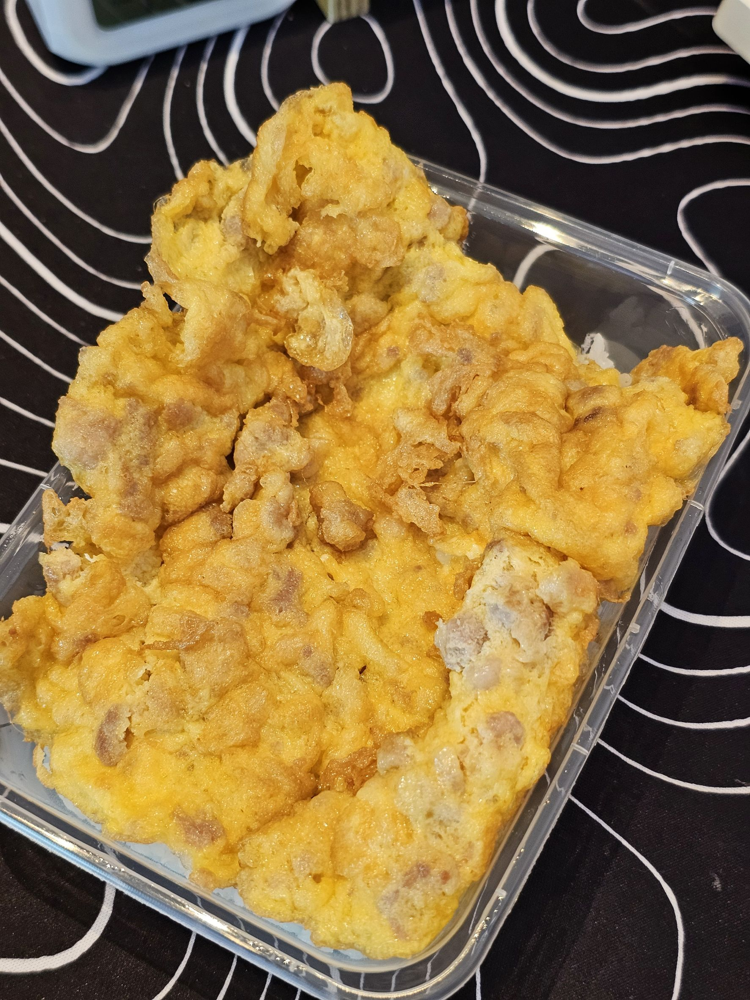

# 🍛 Kaprao52 (กะเพรา 52) — World-Class Street Food



[](https://vitejs.dev/)
[](https://reactjs.org/)
[](https://www.typescriptlang.org/)
[](https://supabase.com/)
[](https://tailwindcss.com/)

> **The Ultimate Street Food Ordering App** — สั่งอาหาร, สะสมพอยท์, ลุ้นหวย, แลกรางวัล ทุกอย่างจบในแอพเดียว! 🚀

---

## 📱 Vision & Purpose
**Kaprao52** ไม่ใช่แค่แอพสั่งอาหารธรรมดา แต่เป็น **Progressive Web App (PWA)** ที่รวบรวมระบบ **Gamification** เข้ากับอาหารสตรีทฟู้ดจานโปรด เพื่อให้ลูกค้ารู้สึกสนุกทุกครั้งที่สั่ง และกลับมาใช้งานซ้ำด้วยระบบ Loyalty ที่แข็งแกร่ง

---

## 🌟 Key Highlights

### ⚡ Seamless Guest-to-Member Flow
- **Order First, Login Later:** ไม่ต้อง Login ก็สั่งได้ทันที (Guest Mode)
- **Magic Claim:** Login LINE ทีหลัง ระบบจะดึงพอยท์จาก Guest Order เข้ากระเป๋าให้โดยอัตโนมัติ

### 🛵 Real-time Order Tracking
- **Live Status:** ติดตามสถานะออเดอร์แบบ Real-time ผ่าน **Supabase Realtime**
- **Visual Timeline:** แอนิเมชันสวยงาม เข้าใจง่าย ตั้งแต่รับออเดอร์ยันส่งถึงมือ

### 🎮 Gamification & Loyalty (The Fun Part!)
- **Tier System:** สะสมยอดสั่งเพื่อเลื่อน Tier จาก **Member → Gold → VIP** พร้อมรับสิทธิพิเศษที่เพิ่มขึ้น
- **Lottery System:** ทุกออเดอร์ 100 บาท รับตั๋วหวยฟรี! ลุ้นเลขท้ายออเดอร์ตรงงวดรัฐบาล = ทานฟรี! 🎟️
- **Wheel & Streaks:** หมุนวงล้อรายวัน และสะสม Streak การสั่งเพื่อรับโบนัสพอยท์พิเศษ

---

## 🍱 Smart Menu System

| Feature | Description |
| :--- | :--- |
| **Deep Customization** | เลือกเนื้อสัตว์, ความเผ็ด, ท็อปปิ้ง (ไข่ดาว/เจียว/เยี่ยวม้า) ได้ตามใจ |
| **Smart Cart** | คำนวณส่วนลดอัตโนมัติ, Preview ตั๋วหวยก่อนกดสั่งจริง |
| **Voice Order** | สั่งด้วยเสียงด้วยเทคโนโลยี AI (Voice Integration) |
| **Thinking...?** | ให้ระบบสุ่มเมนูให้ หากเลือกไม่ถูก (Random Menu) |

---

## 🛠️ Tech Stack & Architecture

### Frontend
- **React 18 & TypeScript:** โครงสร้างที่แข็งแรงและปลอดภัย
- **TailwindCSS & Framer Motion:** ดีไซน์ที่ลื่นไหลและพรีเมียม
- **Zustand & React Query:** จัดการ State และ Data Fetching อย่างมีประสิทธิภาพ

### Backend & Infrastructure
- **Supabase (PostgreSQL):** ฐานข้อมูลประสิทธิภาพสูงพร้อม Realtime capability
- **LINE LIFF SDK:** เชื่อมต่อกับ Ecosystem ของ LINE อย่างไร้รอยต่อ
- **PWA Ready:** ใช้งานได้เหมือนแอพพื้นฐาน รองรับการทำงาน Offline

---

## 🚀 Getting Started

### 1. Prerequisites
- **Node.js 18+**
- **Supabase Project**
- **LINE Developers account (LIFF ID)**

### 2. Installation & Setup
```bash
# Clone the coolest repository
git clone https://github.com/Sorawittj/Kaprao-app.git

# Install dependencies
npm install

# Setup Environment
cp .env.example .env
# Fill in VITE_SUPABASE_URL, VITE_SUPABASE_ANON_KEY, and VITE_LIFF_ID
```

### 3. Database Prep
รัน SQL เหล่านี้ใน Supabase SQL Editor:
1. `SUPABASE_COMPLETE_SETUP.sql`
2. `MENU_OVERHAUL.sql`
3. `GUEST_ORDER_MERGE_SQL.sql`

---

## 📂 Project Structure (Quick Tour)

```
src/
├── app/          # Providers & App Entry
├── features/     # Logic แยกตาม Feature (Orders, Points, Menu, etc.)
├── components/   # UI Components (Reusable)
├── lib/          # External Integrations (Supabase, LIFF, Analytics)
├── store/        # State Management (Zustand)
└── utils/        # Helper Functions & Formatters
```

---

## 📸 Shop Gallery

<div align="center">
  
  
  
</div>

---

## 🔒 Security
- **Row Level Security (RLS):** ปกป้องข้อมูลผู้ใช้อย่างแน่นหนา
- **Tracking Tokens:** Guest เข้าถึงออเดอร์ได้เฉพาะเจ้าของออเดอร์จริงเท่านั้น
- **RPC Logic:** การโอนพอยท์และข้อมูลชุดใหญ่ทำผ่าน Server-side functions เพื่อความปลอดภัยสูงสุด

---

**Developed with ❤️ by [Sorawittj](https://github.com/Sorawittj)**  
*© 2026 Kaprao52 — World-Class Edition 🚀*